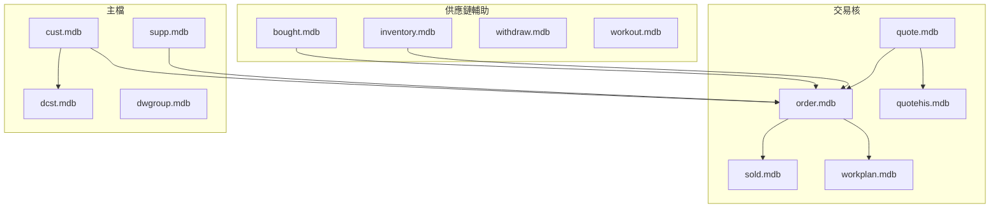

# `isin/` Legacy Access — 總遷移盤點報告

| 項目 | 內容 |
| --- | --- |
| **範圍** | 庫存 [`LEGACY_ACCESS_MDB_INVENTORY.md`](../../LEGACY_ACCESS_MDB_INVENTORY.md) 掃描根 **`/nas/isin`**；本目錄子報告沿用 **`isin/*.mdb` 歷史檔名** 對照，實際 **`analyze-access` 路徑** 以庫存 **「同名檔主檔判定」** 與各子報告 **權威檔案路徑** 為準（多數主檔在根下 `*.mdb`，少數在 `isin/*.mdb`）。 |
| **盤點時間 (UTC)** | 2026-05-15（子報告與 JSON 於同日依主檔重掃更新） |
| **排除** | `isin/ACUSELOG.MDB` — 依指示不重複分析（若已有他處結論，請於實作階段併入稽核／日誌策略） |
| **單檔報告數** | 31（見 [§6 子報告索引](#6-子報告索引)） |
| **方法聲明** | Access 內多未宣告 FK；本報告「跨檔關聯」係依 **欄位同名共現**、業務檔名分群與各子報告 §2／§3 敘述 **人工＋半自動彙整**，**不**等同資料庫 FK。 |

---

## 1. 目的與讀法

- 協助決策：**哪些 .mdb 必須進入新系統的資料遷移範圍**，哪些可改為 **應用設定、一次性匯入或捨棄**。
- 細部欄位與樣本請開各檔 **`{STEM}_MDB_MIGRATION_REPORT.md`**（骨架見 [`access-migration-report/SKILL.md`](../../access-migration-report/SKILL.md)）。
- **主檔路徑**：勿再假設資料一律在 `/nas/isin/isin/`；請以庫存 **「同名檔主檔判定」** 為準（以修改時間為主、同分時比較檔案大小）。
- 機器可重現之結構／樣本 JSON 置於 [`json/`](json/)（`*.samples.json`）；主檔若在根目錄已於 2026-05-15 以 `generate-isin-migration-reports.ts --refresh-json` 重掃。

---

## 2. 遷移必要性矩陣（每檔一案）

**等級說明**

| 等級 | 意義 |
| --- | --- |
| **必遷** | 核心交易或主檔；新系統若要延續業務，應有對應資料模型並匯入。 |
| **建議遷** | 與訂單／報價／工單鏈相關之輔助資料；多數場景需要，可視上線範圍分期。 |
| **選遷** | 稽核、暫存、權限、開發期功能開關等；依法遵與產品需求決定。 |
| **不必遷** | 字典可重建、純 UI 選項、與他檔重複之設定殼；不須以獨立 legacy DB 形式存續。 |

| 相對路徑（歷史對照） | 整體角色（一句） | 遷移必要性 | 理由（摘要） | 子報告 |
| --- | --- | --- | --- | --- |
| `isin/Should.mdb` | 功能／畫面開關列（`fno`／`fname`） | 選遷 | 非交易本體；可改成功能旗標設定 | [SHOULD](SHOULD_MDB_MIGRATION_REPORT.md) |
| `isin/acmaster.mdb` | 公司殼、選項、`sysinfo` 等 | 不必遷 | 與 `master.mdb` 大量欄位重疊；宜收斂為 **應用設定** 或單次 seed | [ACMASTER](ACMASTER_MDB_MIGRATION_REPORT.md) |
| `isin/acstation.mdb` | 連線／站所登錄 | 選遷 | 稽核價值為主；非核心交易 | [ACSTATION](ACSTATION_MDB_MIGRATION_REPORT.md) |
| `isin/audit.mdb` | 資料變更稽核 | 選遷 | 法遵／除錯用；可改寫入現代稽核儲存 | [AUDIT](AUDIT_MDB_MIGRATION_REPORT.md) |
| `isin/bank.mdb` | 銀行字典 | 不必遷 | 可改用公開資料或主檔維護 UI 重建 | [BANK](BANK_MDB_MIGRATION_REPORT.md) |
| `isin/bought.mdb` | 採購／進貨明細 | 建議遷 | 與 `order`／`qno`／`factor` 域欄位高度共現 | [BOUGHT](BOUGHT_MDB_MIGRATION_REPORT.md) |
| `isin/cust.mdb` | 客戶主檔 | 必遷 | 客戶代碼、聯絡、銀行帳戶等主資料 | [CUST](CUST_MDB_MIGRATION_REPORT.md) |
| `isin/dcst.mdb` | 客戶大表（圖／DXF 路徑等） | 必遷 | 與 `cust`／交易檔共用鍵語彙多 | [DCST](DCST_MDB_MIGRATION_REPORT.md) |
| `isin/dcsttmp.mdb` | 與 `dcst` 欄位相似之小檔 | 選遷 | 疑似暫存或離線副本；需確認是否仍寫入 | [DCSTTMP](DCSTTMP_MDB_MIGRATION_REPORT.md) |
| `isin/dwgroup.mdb` | 圖面群組／彙總 | 建議遷 | 與 `dwg_no`／`dcst` 域關聯強 | [DWGROUP](DWGROUP_MDB_MIGRATION_REPORT.md) |
| `isin/focus.mdb` | UI 焦點／小字典 | 不必遷 | 可改前端狀態或捨棄 | [FOCUS](FOCUS_MDB_MIGRATION_REPORT.md) |
| `isin/inventory.mdb` | 庫存／料與訂單鍵 | 建議遷 | `qno`／`metal`／`thick` 與多交易檔共現 | [INVENTORY](INVENTORY_MDB_MIGRATION_REPORT.md) |
| `isin/manager.mdb` | 管理者／權限列 | 選遷 | 新系統通常自有 RBAC；可只遷使用者對照 | [MANAGER](MANAGER_MDB_MIGRATION_REPORT.md) |
| `isin/master.mdb` | 與 `acmaster` 類似之選項＋主檔延伸 | 不必遷 | 與 `acmaster` 欄位大量同名；擇一或全改設定 | [MASTER](MASTER_MDB_MIGRATION_REPORT.md) |
| `isin/order.mdb` | 訂單標頭／明細（`gtable`／`itable`） | 必遷 | 訂單域核心；`qno` 串報價／出貨 | [ORDER](ORDER_MDB_MIGRATION_REPORT.md) |
| `isin/personel.mdb` | 人事／聯絡 | 建議遷 | 與 `cust`／`supp` 共用部分欄位語彙 | [PERSONEL](PERSONEL_MDB_MIGRATION_REPORT.md) |
| `isin/phrase.mdb` | 片語字典 | 不必遷 | 可改 i18n 或表單預設文字 | [PHRASE](PHRASE_MDB_MIGRATION_REPORT.md) |
| `isin/pin.mdb` | PIN／憑證類 | 選遷 | **不得**當一般業務表；需資安流程（雜湊／重發） | [PIN](PIN_MDB_MIGRATION_REPORT.md) |
| `isin/plan.mdb` | 與計畫／`qno` 相關小表 | 選遷 | 量小；確認產品是否仍用 | [PLAN](PLAN_MDB_MIGRATION_REPORT.md) |
| `isin/quote.mdb` | 報價本體 | 必遷 | 與 `order`／`sold` 共享 `qno`、廠商與材規欄位 | [QUOTE](QUOTE_MDB_MIGRATION_REPORT.md) |
| `isin/quotehis.mdb` | 報價歷史 | 建議遷 | 與 `quote`／`price` 語彙一致 | [QUOTEHIS](QUOTEHIS_MDB_MIGRATION_REPORT.md) |
| `isin/show.mdb` | 顯示選項 | 不必遷 | UI 偏好 | [SHOW](SHOW_MDB_MIGRATION_REPORT.md) |
| `isin/sold.mdb` | 銷售出貨 | 必遷 | 與 `order`／`quote` 同域 | [SOLD](SOLD_MDB_MIGRATION_REPORT.md) |
| `isin/station.mdb` | 站所（與 `acstation` 欄位對齊） | 選遷 | 與 `acstation` 成對觀察；擇一納入稽核策略 | [STATION](STATION_MDB_MIGRATION_REPORT.md) |
| `isin/super.mdb` | 特權設定 | 選遷 | 新系統權限模型取代 | [SUPER](SUPER_MDB_MIGRATION_REPORT.md) |
| `isin/super2.mdb` | 特權設定備援 | 選遷 | 同上 | [SUPER2](SUPER2_MDB_MIGRATION_REPORT.md) |
| `isin/supp.mdb` | 供應商主檔 | 必遷 | 與 `cust` 欄位鏡像多；`factor_no` 於交易檔共現 | [SUPP](SUPP_MDB_MIGRATION_REPORT.md) |
| `isin/uselog.mdb` | 使用紀錄 | 選遷 | 可改由應用程式日誌取代 | [USELOG](USELOG_MDB_MIGRATION_REPORT.md) |
| `isin/withdraw.mdb` | 沖銷／退料 | 建議遷 | 與 `order_no`／`inventory` 域一致 | [WITHDRAW](WITHDRAW_MDB_MIGRATION_REPORT.md) |
| `isin/workout.mdb` | 報工／工時 | 建議遷 | 與 `workplan`／`inventory` 共用鍵 | [WORKOUT](WORKOUT_MDB_MIGRATION_REPORT.md) |
| `isin/workplan.mdb` | 工單／排程大表 | 必遷 | 與訂單／材規欄位共現高 | [WORKPLAN](WORKPLAN_MDB_MIGRATION_REPORT.md) |
| `isin/zip.mdb` | 郵遞區號對照 | 不必遷 | 可用政府開放資料或第三方服務重建 | [ZIP](ZIP_MDB_MIGRATION_REPORT.md) |

上表「相對路徑」欄僅為 **與舊盤點 `isin/` 套件對照**；實際讀檔請以庫存 **「同名檔主檔判定」** 與各子報告 **權威檔案路徑** 為準。

**計數摘要**：必遷 8、建議遷 8、選遷 11、不必遷 4（不含已排除之 ACUSELOG）。

---

## 3. 跨檔推斷關聯（無 FK）

### 3.1 方法

- 掃描 31 份 `*.samples.json`（JSON 內 `accessFilePath` 已對齊庫存主檔；檔名仍依歷史 `isin/` stem 命名）之欄位名（大小寫不敏感），欄名出現在 **≥2 個不同 .mdb** 者列為「共現」。
- 共現 **不代表** 外鍵；僅作為遷移時 **候選 join 鍵** 或 **資料域對齊** 線索。
- **信心度**：高＝多檔＋業務語意一致；中＝多檔但欄名較泛用；低＝僅 2 檔或可能同名異義。

### 3.2 業務域分群（概念）

### 3.3 邊清單（節選高訊號欄名）

| 欄名（代表鍵） | 共現檔數（約） | 信心度 | 推斷用途／備註 |
| --- | ---: | --- | --- |
| `qno` | 9 | 高 | 報價／訂單／出貨／庫存／計畫貫穿鍵 |
| `metal`、`thick` | 13 | 高 | 材質／厚度規格；交易與主檔跨檔一致 |
| `actor_no`、`actor` | 10 | 中 | 業務人員；可能對應 `personel` 或外部代碼表 |
| `factor_no`、`factor` | 10 | 高 | 供應商或加工廠；與 `supp`／`cust` 語彙並存 |
| `dwg_no`、`dwg_ref` | 7–10 | 高 | 圖號；連結 `dcst`／`dwgroup`／報價 |
| `qty`、`price` | 多檔 | 中–高 | 數量／單價；`price` 主要於 `quote`／`quotehis`／`sold` |
| `sn` | 12 | 中 | 序號或流水；需對照程式確認全域唯一性 |
| `xx` | 11 | 低 | 欄名過短，可能多義；僅能作弱線索 |
| `date_r` | 11 | 中 | 建檔／異動日文字（常民國年） |
| `zipno`–`cust`／`supp`–`zip` | 3 | 高 | 郵區與主檔地址連結 |
| `acmaster` ↔ `master` 大量同名欄 | 2 | 高 | **重複設定殼**；遷移時應 **去重** 而非建兩套表 |
| `acstation` ↔ `station`（`xuser` 等） | 2 | 高 | 站所登入成對檔案；擇一納入稽核設計 |

完整機械共現列表可由 [`json/`](json/) 內 JSON 以欄名索引重算。

---

## 4. 風險與待辦

- **`/nas/isin/*.mdb` 與 `/nas/isin/isin/*.mdb`（庫存中 `isin/` 子資料夾）**：同名檔主檔已於庫存標註；若業務認定與演算法不同，請改庫存判定流程或人工註記後再重掃。
- **Big5 與日期**：欄位多為文字型民國年；ETL 需明確轉換規則。
- **大表**：`order`、`sold`、`workplan` 列數大；匯入需批次與索引策略（子報告 §6 可重跑取樣）。
- **`dcsttmp`**：名稱暗示暫存；上線前確認是否仍寫入。
- **PIN／憑證**：`pin.mdb` 不得平移為明文；需資安審查。

---

## 5. 產出物與再生指令

- **子報告**：同目錄 `*_MDB_MIGRATION_REPORT.md`（31 份）。
- **JSON**：[`json/*.samples.json`](json/)（結構＋樣本，供交叉比對）。
- **產報腳本**：[`scripts/generate-isin-migration-reports.ts`](../../../../../scripts/generate-isin-migration-reports.ts)。於 repo 根目錄：僅由既有 JSON 組版執行  
  `npx ts-node --project tsconfig.json -r tsconfig-paths/register scripts/generate-isin-migration-reports.ts`；**依庫存主檔路徑重掃 NAS 並組版** 加上 `--refresh-json`。
- **單檔分析**：路徑請用庫存「同名檔主檔判定」之 **主檔相對路徑** 接在掃描根後，例如  
  `npm run analyze-access -- "/nas/isin/order.mdb" --json --sample-limit=15`  
  或  
  `npm run analyze-access -- "/nas/isin/isin/Should.mdb" --json --sample-limit=15`。

---

## 6. 子報告索引

| 檔案 | 報告 |
| --- | --- |
| `Should.mdb` | [SHOULD_MDB_MIGRATION_REPORT.md](SHOULD_MDB_MIGRATION_REPORT.md) |
| `acmaster.mdb` | [ACMASTER_MDB_MIGRATION_REPORT.md](ACMASTER_MDB_MIGRATION_REPORT.md) |
| `acstation.mdb` | [ACSTATION_MDB_MIGRATION_REPORT.md](ACSTATION_MDB_MIGRATION_REPORT.md) |
| `audit.mdb` | [AUDIT_MDB_MIGRATION_REPORT.md](AUDIT_MDB_MIGRATION_REPORT.md) |
| `bank.mdb` | [BANK_MDB_MIGRATION_REPORT.md](BANK_MDB_MIGRATION_REPORT.md) |
| `bought.mdb` | [BOUGHT_MDB_MIGRATION_REPORT.md](BOUGHT_MDB_MIGRATION_REPORT.md) |
| `cust.mdb` | [CUST_MDB_MIGRATION_REPORT.md](CUST_MDB_MIGRATION_REPORT.md) |
| `dcst.mdb` | [DCST_MDB_MIGRATION_REPORT.md](DCST_MDB_MIGRATION_REPORT.md) |
| `dcsttmp.mdb` | [DCSTTMP_MDB_MIGRATION_REPORT.md](DCSTTMP_MDB_MIGRATION_REPORT.md) |
| `dwgroup.mdb` | [DWGROUP_MDB_MIGRATION_REPORT.md](DWGROUP_MDB_MIGRATION_REPORT.md) |
| `focus.mdb` | [FOCUS_MDB_MIGRATION_REPORT.md](FOCUS_MDB_MIGRATION_REPORT.md) |
| `inventory.mdb` | [INVENTORY_MDB_MIGRATION_REPORT.md](INVENTORY_MDB_MIGRATION_REPORT.md) |
| `manager.mdb` | [MANAGER_MDB_MIGRATION_REPORT.md](MANAGER_MDB_MIGRATION_REPORT.md) |
| `master.mdb` | [MASTER_MDB_MIGRATION_REPORT.md](MASTER_MDB_MIGRATION_REPORT.md) |
| `order.mdb` | [ORDER_MDB_MIGRATION_REPORT.md](ORDER_MDB_MIGRATION_REPORT.md) |
| `personel.mdb` | [PERSONEL_MDB_MIGRATION_REPORT.md](PERSONEL_MDB_MIGRATION_REPORT.md) |
| `phrase.mdb` | [PHRASE_MDB_MIGRATION_REPORT.md](PHRASE_MDB_MIGRATION_REPORT.md) |
| `pin.mdb` | [PIN_MDB_MIGRATION_REPORT.md](PIN_MDB_MIGRATION_REPORT.md) |
| `plan.mdb` | [PLAN_MDB_MIGRATION_REPORT.md](PLAN_MDB_MIGRATION_REPORT.md) |
| `quote.mdb` | [QUOTE_MDB_MIGRATION_REPORT.md](QUOTE_MDB_MIGRATION_REPORT.md) |
| `quotehis.mdb` | [QUOTEHIS_MDB_MIGRATION_REPORT.md](QUOTEHIS_MDB_MIGRATION_REPORT.md) |
| `show.mdb` | [SHOW_MDB_MIGRATION_REPORT.md](SHOW_MDB_MIGRATION_REPORT.md) |
| `sold.mdb` | [SOLD_MDB_MIGRATION_REPORT.md](SOLD_MDB_MIGRATION_REPORT.md) |
| `station.mdb` | [STATION_MDB_MIGRATION_REPORT.md](STATION_MDB_MIGRATION_REPORT.md) |
| `super.mdb` | [SUPER_MDB_MIGRATION_REPORT.md](SUPER_MDB_MIGRATION_REPORT.md) |
| `super2.mdb` | [SUPER2_MDB_MIGRATION_REPORT.md](SUPER2_MDB_MIGRATION_REPORT.md) |
| `supp.mdb` | [SUPP_MDB_MIGRATION_REPORT.md](SUPP_MDB_MIGRATION_REPORT.md) |
| `uselog.mdb` | [USELOG_MDB_MIGRATION_REPORT.md](USELOG_MDB_MIGRATION_REPORT.md) |
| `withdraw.mdb` | [WITHDRAW_MDB_MIGRATION_REPORT.md](WITHDRAW_MDB_MIGRATION_REPORT.md) |
| `workout.mdb` | [WORKOUT_MDB_MIGRATION_REPORT.md](WORKOUT_MDB_MIGRATION_REPORT.md) |
| `workplan.mdb` | [WORKPLAN_MDB_MIGRATION_REPORT.md](WORKPLAN_MDB_MIGRATION_REPORT.md) |
| `zip.mdb` | [ZIP_MDB_MIGRATION_REPORT.md](ZIP_MDB_MIGRATION_REPORT.md) |

---

*本總報告依 `isin/` 單檔盤點結果與欄位共現分析彙整；計畫書見使用者核准之 isin MDB migration 計畫。*
