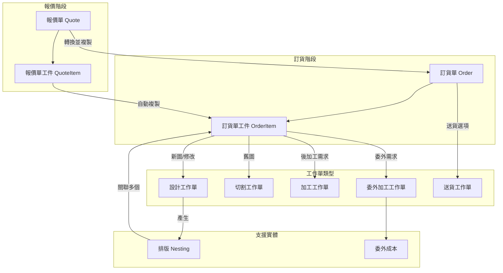

# CRM 工作流程重構計畫

## 架構概覽



## 一、後端資料庫變更

### 1.1 重新命名現有實體

- 將 `WorkOrder` 重新命名為 `Order`（訂貨單）
- 將 `WorkOrderItem` 重新命名為 `OrderItem`（訂貨單工件）
- 更新所有相關的 service、controller、module 檔案名稱

### 1.2 新增工作單實體（各自獨立表格）

**DesignWorkOrder（設計工作單）**

- `id`: string (PK)
- `orderId`: string (FK → Order)
- `orderItemId`: number (FK → OrderItem)
- `assignedStaffId`: string (FK → Staff, 設計師)
- `supervisorStaffId`: string (FK → Staff, 設計主管)
- `drawingNumber`: string (圖號)
- `customerFile`: string (客戶圖面)
- `cadFile`: string (DWG 檔案)
- `cncFile`: string (CNC 檔案)
- `status`: enum (pending, in_progress, completed)
- `priority`: number
- `notes`: string
- `createdAt`, `updatedAt`, `completedAt`

**CuttingWorkOrder（切割工作單）**

- `id`: string (PK)
- `orderId`: string (FK → Order)
- `nestingId`: number (FK → Nesting, 可選)
- `assignedStaffId`: string (FK → Staff)
- `machineId`: string (機台識別)
- `material`: string
- `thickness`: string
- `status`: enum (pending, assigned, in_progress, completed)
- `notes`: string
- `createdAt`, `updatedAt`, `completedAt`

**ProcessingWorkOrder（加工工作單）**

- `id`: string (PK)
- `orderId`: string (FK → Order)
- `orderItemId`: number (FK → OrderItem)
- `processingType`: string (折床/攻牙/焊接等)
- `assignedStaffId`: string (FK → Staff)
- `status`: enum (pending, in_progress, completed)
- `notes`: string
- `createdAt`, `updatedAt`, `completedAt`

**OutsourcingWorkOrder（委外加工工作單）**

- `id`: string (PK)
- `orderId`: string (FK → Order)
- `orderItemId`: number (FK → OrderItem)
- `vendorId`: number (FK → Vendor)
- `processingType`: string
- `status`: enum (pending, shipped, processing, completed, returned)
- `shippedAt`: timestamp
- `returnedAt`: timestamp
- `notes`: string
- `createdAt`, `updatedAt`

**DeliveryWorkOrder（送貨工作單）**

- `id`: string (PK)
- `orderId`: string (FK → Order)
- `driverId`: string (FK → Staff, 司機)
- `deliveryAddress`: string
- `contactPhone`: string
- `scheduledDate`: date
- `status`: enum (pending, ready, in_transit, delivered)
- `notes`: string
- `createdAt`, `updatedAt`, `deliveredAt`

### 1.3 新增支援實體

**Nesting（排版）**

- `id`: number (PK, auto)
- `nestingNumber`: string (排版圖號，格式：客戶型號+年月日+流水號+版次)
- `orderId`: string (FK → Order)
- `designWorkOrderId`: string (FK → DesignWorkOrder)
- `material`: string
- `thickness`: string
- `quantity`: number (張數)
- `nestingImageFile`: string (排版圖 PDF/圖片)
- `cncFile`: string
- `status`: enum (draft, finalized)
- `createdAt`, `updatedAt`

**NestingItem（排版-工件關聯）**

- `id`: number (PK)
- `nestingId`: number (FK → Nesting)
- `orderItemId`: number (FK → OrderItem)
- `quantity`: number (該工件在此排版中的數量)

**OutsourcingCost（委外成本）**

- `id`: number (PK)
- `outsourcingWorkOrderId`: string (FK → OutsourcingWorkOrder)
- `costType`: string (加工費/運費等)
- `amount`: decimal
- `description`: string
- `invoiceNumber`: string (發票號碼)
- `createdAt`, `updatedAt`

### 1.4 修改現有實體

**OrderItem (原 WorkOrderItem) 新增欄位**

- `drawingNumber`: string (圖號)
- `isNested`: boolean (是否已排版)
- `nestingId`: number (FK → Nesting, 可選)

**Order (原 WorkOrder) 新增欄位**

- `quoteId`: string (FK → Quote, 來源報價單)
- `status`: enum (pending, design, cutting, processing, ready_for_delivery, delivered, completed)

**Quote 新增欄位**

- `designFee`: decimal (設計費)
- `shippingFee`: decimal (運費)
- `isSupplyMaterial`: boolean (是否代料)

## 二、後端邏輯變更

### 2.1 報價單轉訂貨單 Service

修改 `quote.service.ts` 中的 `convertToWorkOrder` 方法：

1. 建立 Order（複製基本資訊）
2. 複製所有 QuoteItem 到 OrderItem
3. 根據每個 OrderItem 的 source 欄位判斷並自動產生對應工作單：

   - source = 新圖 or 修改 → 產生 DesignWorkOrder
   - source = 舊圖 → 直接產生 CuttingWorkOrder

4. 檢查 postProcessing 欄位，為需要後加工的項目產生 ProcessingWorkOrder 或 OutsourcingWorkOrder
5. 若 shippingMethod = 送貨 → 產生 DeliveryWorkOrder

### 2.2 新增各工作單 Service

- `design-work-order.service.ts`
- `cutting-work-order.service.ts`
- `processing-work-order.service.ts`
- `outsourcing-work-order.service.ts`
- `delivery-work-order.service.ts`
- `nesting.service.ts`
- `outsourcing-cost.service.ts`

### 2.3 工作單狀態流轉邏輯

- DesignWorkOrder 完成 → 可建立 Nesting → 自動產生 CuttingWorkOrder
- CuttingWorkOrder 完成 → 檢查是否有 ProcessingWorkOrder
- 所有工作單完成 → Order 狀態更新為 ready_for_delivery
- DeliveryWorkOrder 完成 → Order 狀態更新為 completed

## 三、前端變更

### 3.1 頁面重新命名與調整

- `Orders.vue` → 訂貨單管理（保留現有功能，新增工作單概覽）
- `WorkOrderItem.vue` → 訂貨單工件詳情

### 3.2 新增頁面

- `DesignWorkOrders.vue` - 設計工作單列表與管理
- `CuttingWorkOrders.vue` - 切割工作單列表與管理
- `ProcessingWorkOrders.vue` - 加工工作單列表與管理
- `OutsourcingWorkOrders.vue` - 委外加工工作單列表
- `DeliveryWorkOrders.vue` - 送貨工作單列表
- `NestingManagement.vue` - 排版管理頁面
- 注意：需使用 `EditableDataTable`

### 3.3 修改轉換流程

更新 `Quotes.vue` 中的轉工單 Modal：

- 新增來源選項（針對每個 QuoteItem）
- 新增後加工需求勾選
- 顯示將自動產生的工作單預覽

### 3.4 新增工作單看板視圖（可選）

- 以看板形式顯示各階段工作單狀態
- 支援拖拽更新狀態

## 四、資料庫遷移步驟

### 4.1 建立新表格

1. 建立新的工作單表格（design_work_order, cutting_work_order 等）
2. 建立 nesting 和 nesting_item 表格
3. 建立 outsourcing_cost 表格

### 4.2 重新命名現有表格

1. `work_order` → `order`
2. `work_order_item` → `order_item`
3. 更新所有外鍵關聯

### 4.3 新增欄位

1. 在 order_item 新增 drawing_number, is_nested, nesting_id
2. 在 order 新增 quote_id, status
3. 在 quote 新增 design_fee, shipping_fee, is_supply_material

## 五、檔案結構變更

```
apps/backend/src/crm/
├── order/                    # 原 work-order，重新命名
│   ├── entities/
│   │   └── order.entity.ts
│   ├── order.controller.ts
│   ├── order.module.ts
│   └── order.service.ts
├── order-item/               # 原 work-order-item，重新命名
├── design-work-order/        # 新增
├── cutting-work-order/       # 新增
├── processing-work-order/    # 新增
├── outsourcing-work-order/   # 新增
├── delivery-work-order/      # 新增
├── nesting/                  # 新增
└── outsourcing-cost/         # 新增

apps/frontend/src/views/CRM/
├── Orders.vue                # 訂貨單（調整）
├── OrderItems.vue            # 原 WorkOrderItem.vue
├── DesignWorkOrders.vue      # 新增
├── CuttingWorkOrders.vue     # 新增
├── ProcessingWorkOrders.vue  # 新增
├── OutsourcingWorkOrders.vue # 新增
├── DeliveryWorkOrders.vue    # 新增
└── NestingManagement.vue     # 新增
```

## 六、API 端點規劃

### 訂貨單相關

- `POST /orders` - 建立訂貨單
- `GET /orders` - 取得訂貨單列表
- `GET /orders/:id` - 取得單一訂貨單
- `PUT /orders/:id` - 更新訂貨單
- `DELETE /orders/:id` - 刪除訂貨單
- `GET /orders/:id/work-orders` - 取得訂貨單的所有工作單

### 各類工作單 (以設計工作單為例)

- `POST /design-work-orders` - 建立設計工作單
- `GET /design-work-orders` - 取得列表
- `PUT /design-work-orders/:id/status` - 更新狀態
- `PUT /design-work-orders/:id/assign` - 分派設計師

### 排版相關

- `POST /nestings` - 建立排版
- `GET /nestings` - 取得排版列表
- `POST /nestings/:id/items` - 新增排版工件
- `DELETE /nestings/:id/items/:itemId` - 移除排版工件

## 七、實作優先順序建議

1. **Phase 1**: 資料庫重新命名 (WorkOrder → Order)
2. **Phase 2**: 新增工作單實體與基本 CRUD
3. **Phase 3**: 實作報價單自動轉換邏輯
4. **Phase 4**: 新增前端工作單管理頁面
5. **Phase 5**: 實作排版功能
6. **Phase 6**: 實作委外成本追蹤
7. **Phase 7**: 工作單狀態流轉與通知