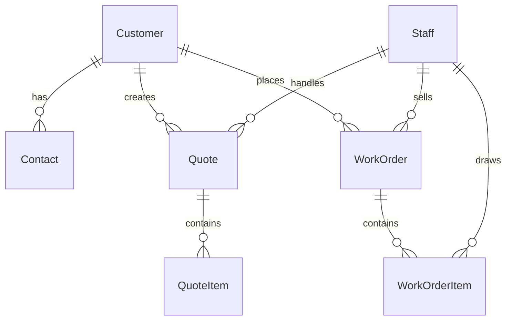

# CRM 模塊實作計劃

## 架構概述

建立完整的 CRM 模塊，包含以下實體和關係：

## Backend 實作

### 1. 模塊結構

在 `apps/backend/src/crm/` 下建立以下模塊：

- **customer/** - 客戶管理
  - `customer.module.ts`
  - `customer.controller.ts`
  - `customer.service.ts`
  - `entities/customer.entity.ts`

- **contact/** - 聯絡人管理
  - `contact.module.ts`
  - `contact.controller.ts`
  - `contact.service.ts`
  - `entities/contact.entity.ts`

- **quote/** - 報價單管理
  - `quote.module.ts`
  - `quote.controller.ts`
  - `quote.service.ts`
  - `entities/quote.entity.ts`

- **quote-item/** - 報價單工件管理
  - `quote-item.module.ts`
  - `quote-item.controller.ts`
  - `quote-item.service.ts`
  - `entities/quote-item.entity.ts`

- **work-order/** - 工單管理
  - `work-order.module.ts`
  - `work-order.controller.ts`
  - `work-order.service.ts`
  - `entities/work-order.entity.ts`

- **work-order-item/** - 工單工件管理
  - `work-order-item.module.ts`
  - `work-order-item.controller.ts`
  - `work-order-item.service.ts`
  - `entities/work-order-item.entity.ts`

- **crm.module.ts** - 主模塊，整合所有子模塊

### 2. 實體設計

#### Customer Entity

- 使用 JSON 類型存儲多值欄位（電話、統一編號）
- 關聯到 Contact（一對多）
- 包含所有指定欄位

#### Contact Entity

- 使用 JSON 類型存儲多值電話
- 關聯到 Customer（多對一）

#### Quote Entity

- 關聯到 QuoteItem（一對多）
- 關聯到 Staff（經手人）
- 包含客戶簽名字段

#### QuoteItem Entity

- 關聯到 Quote（多對一）

#### WorkOrder Entity

- 使用 enum 定義運送方式和付款方式
- 關聯到 WorkOrderItem（一對多）
- 關聯到 Customer 和 Staff（業務員）

#### WorkOrderItem Entity

- 使用 enum 定義狀態和來源
- 關聯到 WorkOrder（多對一）
- 關聯到 Staff（繪圖負責人，可為 null）

### 3. Enum 定義

建立 `apps/backend/src/crm/enums/` 目錄：

- `shipping-method.enum.ts` - 運送方式：自取、快遞、貨運
- `payment-method.enum.ts` - 付款方式：現金、轉帳、月結
- `source-type.enum.ts` - 來源：新圖、舊圖、修改
- `work-order-item-status.enum.ts` - 工單工件狀態：Todo、分配繪圖、繪圖中、繪圖完畢、分配加工、加工中、完成

### 4. 服務層功能

每個服務提供標準 CRUD 操作：

- `findAll()` - 查詢所有記錄
- `findOne(id)` - 查詢單一記錄
- `create(data)` - 建立新記錄
- `update(id, data)` - 更新記錄
- `remove(id)` - 刪除記錄

特殊功能：

- QuoteService: `convertToWorkOrder(quoteId)` - 將報價單轉換為工單
- WorkOrderService: 支援查詢和篩選功能

### 5. 控制器設計

遵循現有專案模式，使用 Swagger 文檔：

- 標準 RESTful API 端點
- 適當的 HTTP 狀態碼和錯誤處理
- API 標籤和操作描述

### 6. 模塊註冊

在 `apps/backend/src/app.module.ts` 中導入 `CrmModule`

## Frontend 實作

### 1. API 配置

在 `apps/frontend/src/config/api.ts` 中添加 CRM 相關端點：

- `/crm/customers`
- `/crm/contacts`
- `/crm/quotes`
- `/crm/quote-items`
- `/crm/work-orders`
- `/crm/work-order-items`

### 2. API 服務

建立 `apps/frontend/src/services/crm/` 目錄，包含：

- `customer.service.ts`
- `contact.service.ts`
- `quote.service.ts`
- `work-order.service.ts`

### 3. 頁面更新

更新現有頁面以連接實際 API：

- `apps/frontend/src/views/CRM.vue` - 客戶管理主頁面
- `apps/frontend/src/views/CRM/Quotes.vue` - 報價單管理
- `apps/frontend/src/views/CRM/Orders.vue` - 工單管理

### 4. 新增頁面

建立新頁面：

- `apps/frontend/src/views/CRM/Customers.vue` - 客戶列表和詳情
- `apps/frontend/src/views/CRM/Contacts.vue` - 聯絡人管理（可選，或整合到客戶頁面）

### 5. 路由更新

在 `apps/frontend/src/router/index.ts` 中添加新路由（如需要）

## 實作細節

### 資料庫欄位類型

- 多值欄位（電話、統一編號）：使用 `@Column('json')` 存儲為 JSON 陣列
- 金額欄位：使用 `decimal` 或 `int`（以分為單位）
- 日期欄位：使用 `date` 或 `datetime`
- 檔案名稱：使用 `varchar`

### 關聯關係

- 使用 TypeORM 的 `@ManyToOne` 和 `@OneToMany` 裝飾器
- 適當設置 `eager` 或 `lazy` 載入策略
- 使用 `@JoinColumn` 指定外鍵欄位名稱

### 錯誤處理

- 統一的錯誤回應格式
- 適當的 HTTP 狀態碼
- 驗證輸入資料

## 檔案清單

### Backend (約 30+ 檔案)

- `apps/backend/src/crm/crm.module.ts`
- `apps/backend/src/crm/customer/` (4 檔案)
- `apps/backend/src/crm/contact/` (4 檔案)
- `apps/backend/src/crm/quote/` (4 檔案)
- `apps/backend/src/crm/quote-item/` (4 檔案)
- `apps/backend/src/crm/work-order/` (4 檔案)
- `apps/backend/src/crm/work-order-item/` (4 檔案)
- `apps/backend/src/crm/enums/` (4 檔案)
- 更新 `apps/backend/src/app.module.ts`

### Frontend (約 10+ 檔案)

- 更新 `apps/frontend/src/config/api.ts`
- `apps/frontend/src/services/crm/` (4 服務檔案)
- 更新 `apps/frontend/src/views/CRM.vue`
- 更新 `apps/frontend/src/views/CRM/Quotes.vue`
- 更新 `apps/frontend/src/views/CRM/Orders.vue`
- 新增 `apps/frontend/src/views/CRM/Customers.vue`（如需要）